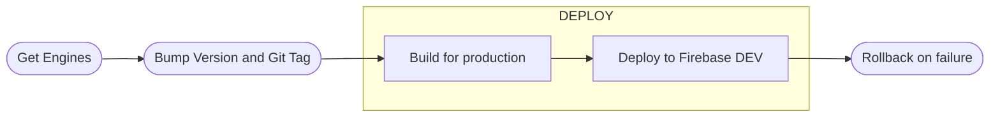

# CI/CD

```mermaid
flowchart LR
    setup([Get Engines]) --> version([Bump Version and Git Tag]) --> build
    subgraph DEPLOY
    build[Build for production] --> deployDev[Deploy to Firebase DEV]
    end
    deployDev --> fail-safe([Rollback on failure])
```
